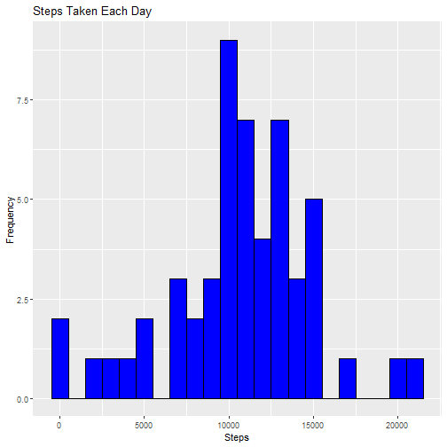
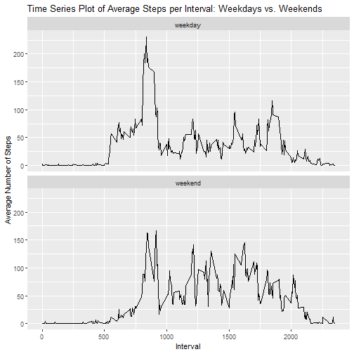

Load the necessary Libraries 

```r
library(ggplot2)
library(dplyr)
library(lubridate)
library(knitr)
```

Loading and Processing the Data

1) Load the Data 

```r
fullData <- read.csv("activity.csv")
```

2) Processing & Transforming the Activity Data

```r
fullData$date <- as.Date(fullData$date, "%Y-%m-%d")
```

Mean Total Number of Steps Taken Per Day

1) Calculate the total steps per day

```r
StepsPerDay <- aggregate(steps ~ date, fullData, FUN = sum)
```

2) Make a histogram of the total number of steps taken each day


```r
g <- ggplot(StepsPerDay, aes(x = steps))
g + geom_histogram(fill = "blue", color = "black", binwidth = 1000) +
    labs(title = "Steps Taken Each Day", x = "Steps", y = "Frequency")
```



3) Calculate and report the mean and median of the total number of steps taken per day


```r
# Mean of Steps
StepsMean <- mean(StepsPerDay$steps, na.rm=TRUE)
knitr::asis_output(paste("**StepsMean:** ", format(round(StepsMean, 2), nsmall = 2, big.mark = ","), "\n\n", sep = ""))
```

**StepsMean:** 10,766.19

```r
# Median of Steps
StepsMedian <- median(StepsPerDay$steps, na.rm=TRUE)
knitr::asis_output(paste("**Median of Steps:** ", format(round(StepsMedian, 2), nsmall = 2, big.mark = ","), "\n\n", sep = ""))
```

**Median of Steps:** 10,765.00

What is the Average Daily Activity Pattern?

1) Make a time series plot (i.e. type = "l") of the 5-minute interval (x-axis) and the average number of steps taken, averaged across all days (y-axis)


```r
# Create average number of steps per 5-min interval
pattern <- aggregate(steps ~ interval, data = fullData, FUN = mean)
# Create a time series plot of average number of steps per interval, annotate the plot
ggplot(pattern, aes(interval, steps)) +
    geom_line() +
    labs(title = "Average Daily Activity Pattern", x = "5-minute intervals", y = "Average steps")
```


2) Which 5-minute interval, on average across all the days in the dataset, contains the maximum number of steps?


```r
# Interval with maximum number of steps
maxInterval <- pattern[which.max(pattern$steps),]$interval
knitr::asis_output(glue::glue("**Interval with maximum number of steps:** {maxInterval}\n"))
```

**Interval with maximum number of steps:** 835

Imputing Missing Values

1) Calculate and report the total number of missing values in the dataset (i.e. the total number of rows with NAs)


```r
# Number of NAs in the original dataset
MissingValueT <- nrow(fullData[is.na(fullData$steps),])
knitr::asis_output(glue::glue("**MissingValueT:** {MissingValueT}\n"))
```

**MissingValueT:** 2304

2) Devise a strategy for filling in all of the missing values in the dataset. The strategy does not need to be sophisticated. For example, you could use the mean/median for that day, or the mean for that 5-minute interval, etc.

The following strategy for filling in all of the missing values in the dataset involves using the mean/average for the corresponding time interval to replace the missing values. This is done by creating a new dataset that is equal to the original dataset but with the missing data filled in with the average number of steps per 5-minute interval. Then, a histogram is created to show the total number of steps taken each day with the filled data, and the mean and median of the total number of steps taken per day with the filled data are calculated and reported.


```r
# Create average number of steps per 5-min interval
stepsAvg <- aggregate(steps ~ interval, data = fullData, FUN = mean, na.rm = TRUE)

# Create a new dataset that is equal to the original dataset but with the missing data filled in
fullDataFilled <- fullData %>%
  left_join(stepsAvg, by = "interval", suffix = c("", "_avg")) %>%
  mutate(steps = ifelse(is.na(steps), steps_avg, steps)) %>%
  select(interval, date, steps)

# Make a histogram of the total number of steps taken each day with the filled data
StepsPerDayFilled <- aggregate(steps ~ date, fullDataFilled, FUN = sum)
g2 <- ggplot(StepsPerDayFilled, aes(x = steps))
g2 + geom_histogram(fill = "red", color = "black", binwidth = 1000) +
    labs(title = "Steps Taken Each Day (Filled Data)", x = "Steps", y = "Frequency")
```


```r
# Calculate and report the mean and median total number of steps taken per day with the filled data
# Mean of Steps (Filled Data)
StepsMeanFilled <- mean(StepsPerDayFilled$steps, na.rm=TRUE)
knitr::asis_output(paste("**Mean of Steps (Filled Data):** ", format(round(StepsMeanFilled, 2), nsmall = 2, big.mark = ","), "\n\n", sep = ""))
```

**Mean of Steps (Filled Data):** 10,766.19

```r
# Median of Steps (Filled Data)
StepsMedianFilled <- median(StepsPerDayFilled$steps, na.rm=TRUE)
knitr::asis_output(paste("**Median of Steps (Filled Data):** ", format(round(StepsMedianFilled, 2), nsmall = 2, big.mark = ","), "\n\n", sep = ""))
```

**Median of Steps (Filled Data):** 10,766.19

Are there differences in activity patterns between weekdays and weekends?

1) Create a new factor variable in the dataset with two levels – “weekday” and “weekend” indicating whether a given date is a weekday or weekend day.


```r
# Load the necessary libraries
library(ggplot2)

# Create a new factor variable in the dataset with two levels – "weekday" and "weekend"
fullDataFilled$dayType <- ifelse(weekdays(fullDataFilled$date) %in% c("Saturday", "Sunday"), "weekend", "weekday")

# Calculate the average steps for each interval for weekdays and weekends
avgStepsByDayType <- aggregate(steps ~ interval + dayType, data = fullDataFilled, FUN = mean)

# Make a panel plot containing a time series plot of the 5-minute interval and the average number of steps taken, averaged across all weekday days or weekend days
ggplot(avgStepsByDayType, aes(x = interval, y = steps)) +
  geom_line() +
  labs(title = "Time Series Plot of Average Steps per Interval: Weekdays vs. Weekends",
       x = "Interval",
       y = "Average Number of Steps") +
  facet_wrap(~dayType, ncol = 1)
```


